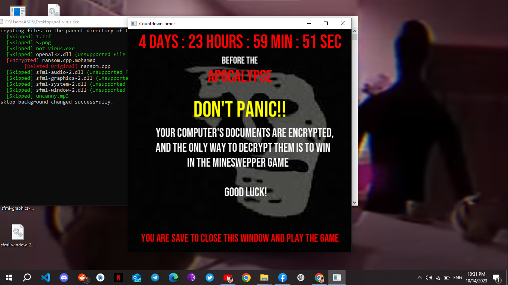
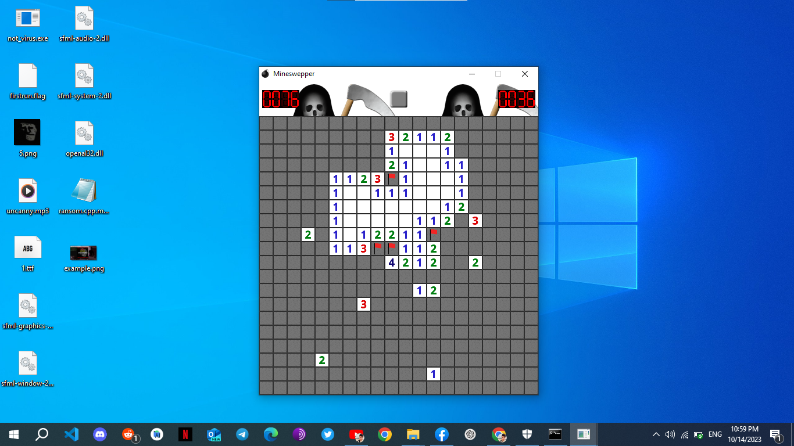

# RansomSweeper A Crypto Challenge Adventure
Welcome to **RansomSweeper**, a project that combines the thrilling world of ransomware with the classic game of Minesweeper! Dive into a creative and educational exploration of how ransomware works and challenge your wits in a game of skill and strategy.
<div align="center">

## Watch the Video Demo

[](https://www.youtube.com/watch?v=nngkiTYDoIo)

</div>

## Table of Contents
- [Overview](#overview)
- [Ransomware](#ransomware)
  - [Building Ransomware](#building-ransomware)
  - [Running Ransomware](#running-ransomware)
- [Minesweeper Game](#minesweeper-game)
  - [Building Minesweeper Game](#building-minesweeper-game)
  - [Playing Minesweeper Game](#playing-minesweeper-game)
- [Disclaimer](#disclaimer)

## Overview

**RansomSweeper** consists of two intriguing components:

1. **Ransomware**: A script that encrypts files in its current directory and presents the user with a suspenseful SFML window, challenging them to play Minesweeper to decrypt their precious files.

2. **Minesweeper Game**: The game that holds the key to decrypting your files. Successfully conquer this classic game of strategy to regain access to your encrypted data.
## Ransomware

The ransomware component of **RansomSweeper** encrypts files within its current directory, adding an extra layer of excitement to the world of ransomware.

### Building Ransomware

Prepare to unleash the ransomware with these steps:

1. Ensure you have the required dependencies, including OpenSSL and SFML, installed on your system.

2. Open your command prompt and navigate to the project directory using the `cd` command.

3. Execute the following command:

   ```bash
   build_ransom.bat
This command compiles the ransomware script and creates the executable file not_virus.exe in the ransomware directory (notice that when you run it it will start encrypting the files in the current directory and it's subdir).
### Running Ransomware
the not_virus.exe file will be outputed in ransomware/not_virus.exe after running it will start encrypting the files in the current directory and it's subdir and added .mohamed extension, carful when you run it (you may olso need exlude the project folder from any antivirus) 
## Minesweeper Game
The Minesweeper game in mineswepper offers you a chance to redeem your encrypted files. Master this challenging game to decrypt your data and thwart the ransomware.
### Building Minesweeper Game
To create the Minesweeper game, follow these steps:

1. Ensure you have the required dependencies, including SFML, properly installed on your system.

2. Open your command prompt and navigate to the project directory using the cd command.

3. Execute the following command:
   ```bash
     build_minesweeper.bat
 
This command compiles the Minesweeper game and generates the executable file minesweeper/minesweeper.exe.

### Playing Minesweeper Game
Launch the Minesweeper game by running the minesweeper/minesweeper.exe file. Test your strategy and logic skills, and once you win, you can decrypt your files and outsmart the ransomware (the encrypted file (.mohamed) has to be in the same directory as you minesweeper game in order to decrypte and restor them).


## Disclaimer
**Important Notice:** The **RansomSweeper** project and its included code are meant for educational and research purposes only (and for fun). This code, especially the ransomware component, is provided for educational insights into cybersecurity, encryption, and game development. The developer and maintainer of this project do not endorse or support any malicious or illegal use of this code.


